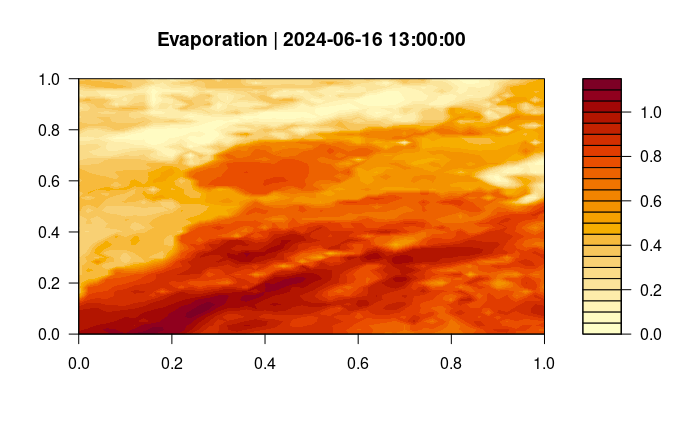

Query grid as NetCDF
================

Retrieve a grid time series from the Meteomatics Weather API and save it
as netcdf files

First you have to import the meteomatics module and the lubridate
library

``` r
suppressMessages(library(lubridate))
suppressMessages(library(MeteomaticsRConnector))
```

Input here your username and password from your meteomatics profile

``` r
username <- "r-community"
password <- "Utotugode673"
```

Specify the Path and filename where the file should be saved to

``` r
dir <- tempdir()
filename <- paste(dir, "grid.nc", sep = "/")
```

Define a startdate and endddate as POSIXct class

``` r
startdate <- as.POSIXct(format(Sys.time()-hours(24), format="%Y-%m-%d %H:00:00"), tz="UTC")
enddate <- as.POSIXct(format(Sys.time(), format="%Y-%m-%d %H:00:00"), tz="UTC")

interval <- "PT1H"
```

Input here the limiting coordinates for the region of interest

``` r
lat_N <- 50
lon_W <- -15
lat_S <- 20
lon_E <- 10
resolution <- "0.5,0.5" # or "1,0.5"
```

Choose the model and parameter you want to query

``` r
parameter <- "evapotranspiration_1h:mm"
model <- "mix"
```

In the following, the request will start. If there is an error in the
request as for example a wrong parameter or a date that doesn’t exist,
you get a message.

``` r
query_netcdf(filename, startdate, enddate, interval, parameter,
             lat_N, lon_W, lat_S, lon_E, resolution, username, password,
             model = model)
```

    ## Calling URL:
    ##  https://api.meteomatics.com/2024-06-16T16:00:00Z--2024-06-17T16:00:00Z:PT1H/evapotranspiration_1h:mm/50,-15_20,10:0.5,0.5/netcdf?model=mix

    ## [1] "Saved netcdf file as /tmp/Rtmp0FYDJI/grid.nc"

To view the NetCDF File you can use external software such as Panoply,
for using NetCDF files in R the ncdf4 package is required. After opening
the file you can print the content of the NetCDF file and get the data
into a dataframe.

``` r
suppressMessages(require(ncdf4))

nc <- nc_open(filename)
  print(nc)
```

    ## File /tmp/Rtmp0FYDJI/grid.nc (NC_FORMAT_NETCDF4):
    ## 
    ##      2 variables (excluding dimension variables):
    ##         8 byte int crs_wgs84[]   (Contiguous storage)  
    ##             grid_mapping_name: latitude_longitude
    ##             semi_major_axis: 6378137
    ##             inverse_flattening: 298.257223563
    ##             longitude_of_prime_meridian: 0
    ##             spatial_ref: GEOGCS["WGS 84",DATUM["WGS_1984",SPHEROID["WGS 84",6378137,298.257223563,AUTHORITY["EPSG","7030"]],AUTHORITY["EPSG","6326"]],PRIMEM["Greenwich",0,AUTHORITY["EPSG","8901"]],UNIT["degree",0.0174532925199433,AUTHORITY["EPSG","9122"]],AUTHORITY["EPSG","4326"]]
    ##             crs_wkt: GEOGCS["WGS 84",DATUM["WGS_1984",SPHEROID["WGS 84",6378137,298.257223563,AUTHORITY["EPSG","7030"]],AUTHORITY["EPSG","6326"]],PRIMEM["Greenwich",0,AUTHORITY["EPSG","8901"]],UNIT["degree",0.0174532925199433,AUTHORITY["EPSG","9122"]],AUTHORITY["EPSG","4326"]]
    ##         double evapotranspiration_1h[longitude,latitude,time]   (Contiguous storage)  
    ##             grid_mapping: crs_wgs84
    ##             units: mm
    ## 
    ##      3 dimensions:
    ##         latitude  Size:61 
    ##             units: degrees_north
    ##             standard_name: latitude
    ##             axis: Y
    ##         longitude  Size:51 
    ##             units: degrees_east
    ##             standard_name: longitude
    ##             axis: X
    ##         time  Size:25 
    ##             units: seconds since 1970-01-01 00:00:00 UTC
    ##             calendar: gregorian
    ##             long_name: FIELD Time UTC
    ##             axis: T
    ## 
    ##     6 global attributes:
    ##         Service: Meteomatics Weather API
    ##         Website: www.meteomatics.com
    ##         Contact: info@meteomatics.com
    ##         Conventions: CF-1.8
    ##         Model: mix
    ##         Parameter: evapotranspiration_1h

``` r
  data <- ncvar_get(nc = nc)
nc_close(nc)
```

Now you can plot the data you recieved

``` r
filled.contour(data[,,2], main=paste0("Evaporation | ", startdate))
```


