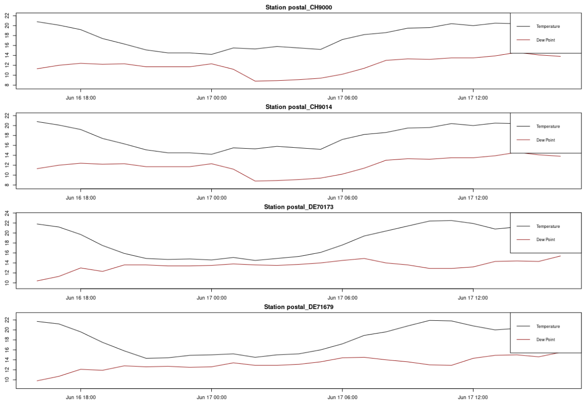

Query timeseries for special locations
================

Retrieve a time series from the Meteomatics Weather API

First you have to import the meteomatics module and the lubridate
library

``` r
suppressMessages(library(lubridate))
suppressMessages(library(MeteomaticsRConnector))
```

Input here your username and password from your meteomatics profile

``` r
username <- "r-community"
password <- "Utotugode673"
```

Define a startdate and endddate as POSIXct class

``` r
startdate <- as.POSIXct(format(Sys.time()-hours(24), format="%Y-%m-%d %H:00:00"), tz="UTC")
enddate <- as.POSIXct(format(Sys.time(), format="%Y-%m-%d %H:00:00"), tz="UTC")

interval <- "PT1H"
```

Choose the parameters and model you want to get and write them in the
list. Check here which parameters are available:
<https://www.meteomatics.com/en/api/available-parameters/>

``` r
parameters <- list("t_2m:C", "dew_point_2m:C", "relative_humidity_2m:p", "precip_1h:mm")
```

Specify the locations for your query

``` r
postal_code <- list('DE'= c(71679, 70173), 'CH' = c(9014, 9000))
```

In the following, the request will start. If there is an error in the
request as for example a wrong parameter or a date that doesn’t exist,
you get a message.

``` r
df <- query_special_locations_timeseries (startdate, enddate, interval,
                                                          parameters, username, password,
                                                          postal_code = postal_code,
                                                          on_invalid = "fill_with_invalid")
```

    ## Calling URL:
    ##  https://api.meteomatics.com/2024-06-16T16:00:00Z--2024-06-17T16:00:00Z:PT1H/t_2m:C,dew_point_2m:C,relative_humidity_2m:p,precip_1h:mm/postal_DE71679+postal_DE70173+postal_CH9014+postal_CH9000/csv?model=mix&on_invalid=fill_with_invalid

``` r
print(head(df))
```

    ##      station_id           validdate t_2m:C dew_point_2m:C
    ## 1 postal_CH9000 2024-06-16 16:00:00   20.8           11.3
    ## 2 postal_CH9000 2024-06-16 17:00:00   20.1           12.0
    ## 3 postal_CH9000 2024-06-16 18:00:00   19.2           12.4
    ## 4 postal_CH9000 2024-06-16 19:00:00   17.4           12.2
    ## 5 postal_CH9000 2024-06-16 20:00:00   16.3           12.3
    ## 6 postal_CH9000 2024-06-16 21:00:00   15.1           11.7
    ##   relative_humidity_2m:p precip_1h:mm
    ## 1                   54.4            0
    ## 2                   59.9            0
    ## 3                   64.7            0
    ## 4                   71.3            0
    ## 5                   77.3            0
    ## 6                   80.4            0

Now you can use the data for everything you want. For example an
overview plot for all stations you queried

``` r
# Calculate the number of rows and columns based on the unique station IDs
num_stations <- length(unique(df$station_id))
num_cols <- ceiling(num_stations / 4)  # Assuming you want 4 rows
num_rows <- ceiling(num_stations / num_cols)

# Create a new plot with subplots for each station_id
par(mfrow = c(num_rows, num_cols), mar = c(2, 2, 2, 1))
for (station in unique(df$station_id)) {
  # Subset data for the current station_id
  station_data <- subset(df, station_id == station)
  
  # Plot
  plot(station_data$validdate, station_data$`t_2m:C`, type = "l", xlab = "Date", ylab = "Temperature (°C)", main = paste("Station", station), col="black", ylim = c(min(station_data$`dew_point_2m:C`) - 1, max(station_data$`t_2m:C`) + 1))
  lines(station_data$validdate, station_data$`dew_point_2m:C`, col="darkred", type = "l")

  # Add legend
  legend("topright", legend = c("Temperature", "Dew Point"), col = c("black", "darkred"), lty = 1, cex = 0.8)
}
```


