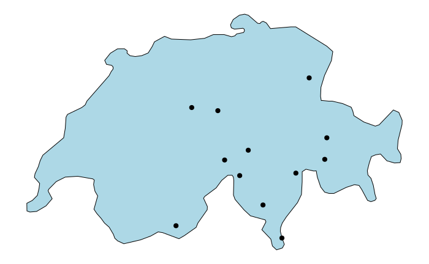

Query Station List
================

Retrieve a station list from the Meteomatics Weather API

First you have to import the meteomatics module and the lubridate
library, the maps library is not necessary for the Query

``` r
suppressMessages(library(lubridate))
suppressMessages(library(MeteomaticsRConnector))
suppressMessages(library(maps))
```

Input here your username and password from your meteomatics profile

``` r
username <- "r-community"
password <- "Utotugode673"
```

The default source for the station list is “mix-obs”

``` r
source <- "mix-obs"
```

Now there is the possibility to change some arguments to filter for
specific stations. For this example stations are filtered based on an
startdate and enddate within observations are available and providing
the t2m and the precip_1h parameter. Additional arguments filter all
stations in the mountains that are closest to 3000m and nearest to the
location 46.6°N and 8.6°E

``` r
#An ISOdatetime of the format %Y-%m-%dT%H:%M:%S. The start date gets converted into UTC if another timezone is selected. If not specified, then the default value is NULL.
startdate <- as.POSIXct("2002-01-01 00:00:00", tz="UTC")
enddate <- as.POSIXct(format(Sys.time()-3*3600, format="%Y-%m-%d %H:00:00"), tz="UTC")


#A list of strings containing the parameters of interest: list("t_2m:C", "dew_point_2m:C", "relative_humidity_1000hPa:p", "precip_1h:mm"). If not specified, then the default value is NULL.
parameter <- list("t_2m:C","precip_1h:mm")

#Height above sea level. It will look first for stations that are close to this height. Integer or float.
elevation <- 3000

#The location as a string, for example location <- ‘47,8_40,15’, location <- ‘uk’ or location <- "47.3,9.3", location <- c("47.3", "9.3").
location <- "46.652,8.61553"
```

In the following, the request will start. If there is an error in the
request as for example a wrong parameter or a date that doesn’t exist,
you get a message.

``` r
station_list <- query_station_list(username, password, source = source, parameters = parameter, startdate = startdate, enddate = enddate, location = location, elevation = elevation)
```

    ## Calling URL:
    ##  https://api.meteomatics.com/find_station?source=mix-obs&parameters=t_2m:C,precip_1h:mm&startdate=2002-01-01T00Z&enddate=2024-06-17T13Z&location=46.652,8.61553&elevation=3000

Now you can have a look at the queried station list

``` r
head(station_list)
```

    ##   Station Category Station Type    ID Hash WMO ID Alternative IDs
    ## 1            SYNOP         SYNO 1517123024  67500             GUE
    ## 2            SYNOP         SYNO 3914716318  67440             GRH
    ## 3            SYNOP         SYNO  841442054  67950             PMA
    ## 4            SYNOP         SYNO 2751948543  67510             ROE
    ## 5            SYNOP         SYNO 2670959045  66590             PIL
    ## 6            SYNOP         SYNO 3878223074  66800             SAE
    ##                Name     Lat     Lon Elevation           Start Date
    ## 1 Gütsch, Andermatt 46.6525 8.61553     2286m 2002-01-01T00:00:00Z
    ## 2    Grimsel Hospiz 46.5717 8.33326     1980m 2002-01-01T00:00:00Z
    ## 3     Piz Martegnas 46.5772 9.52954     2670m 2002-01-01T00:00:00Z
    ## 4            Robièi 46.4431 8.51339     1898m 2002-01-01T00:00:00Z
    ## 5           Pilatus 46.9789 8.25226     2105m 2002-01-01T00:00:00Z
    ## 6            Säntis 47.2495 9.34347     2501m 2002-01-01T00:00:00Z
    ##               End Date Horizontal Distance Vertical Distance Effective Distance
    ## 1 2024-06-17T14:40:00Z             53.4322              -714            7193.43
    ## 2 2024-06-17T14:40:00Z          23362.7000             -1020           87112.70
    ## 3 2024-06-17T14:40:00Z          70383.0000              -330           91008.00
    ## 4 2024-06-17T14:40:00Z          24536.9000             -1102           93411.90
    ## 5 2024-06-17T14:40:00Z          45714.2000              -895          101652.00
    ## 6 2024-06-17T14:40:00Z          86502.5000              -499          117690.00

To have an overview where the stations are located you can use for
example the maps library and plot the station locations

``` r
par(mfrow=c(1,1))
swiss_map <- map("world", regions = "Switzerland", fill = TRUE, col = "lightblue", bg = "white", mar = c(1,1,1,1))
# Plot the stations
points(station_list$Lon, station_list$Lat, col = "black", pch=19)
```


