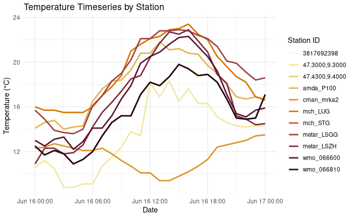

Query Station Timeseries
================

Description Retrieve a station time series from the Meteomatics Weather
API

First you have to import the meteomatics module and the lubridate
library, the ggplot2 library is not necessary for the Query, but for the
example plot

``` r
suppressMessages(library(lubridate))
suppressMessages(library(MeteomaticsRConnector))
suppressMessages(library(ggplot2))
```

Input here your username and password from your meteomatics profile.
Note, that this model ‘mix-obs’ is not available for the ‘R-community’
trial account.

``` r
#username <- "r-community"
#password <- "Utotugode673"
source("login_credentials.R")
```

Input here a startdate, an enddate and the time interval, all as class
POSIXct. The interval tells you, if you get the data in hourly steps,
daily steps or every five minutes in between the startdate and the
enddate. Be aware, that the enddate has to be in the past.

``` r
time_zone <- "UTC"
startdate <- ISOdatetime(year = as.integer(strftime(lubridate::today(), '%Y')),
                      month = as.integer(strftime(lubridate::today(), '%m')),
                      day = as.integer(strftime(lubridate::today(), '%d')) - 1,
                      hour = 00, min = 00, sec = 00, tz = time_zone)
enddate <- ISOdatetime(year = as.integer(strftime(lubridate::today(), '%Y')),
                     month = as.integer(strftime(lubridate::today(), '%m')),
                     day = as.integer(strftime(lubridate::today(), '%d')),
                     hour = 00, min = 00, sec = 00, tz = time_zone)
interval <- "PT1H"
```

Choose the parameters you want to get and put them into a list. Check
here which parameters are available:
<https://www.meteomatics.com/en/api/available-parameters/>

``` r
parameters <- list("t_2m:C")
```

Input here ‘mix-obs’ to get observational data.

``` r
model <- 'mix-obs'
```

You can query available stations using coordinates as a list, or by
using the station IDs. Using the ‘query_station_list’ function you can
find available stations and corresponding IDs.

``` r
coordinates <- list(c(47.3,9.3), c(47.43,9.4))
wmo_ids <- c("066600", "066810")
mch_ids <- c("LUG", "STG")
metar_ids <- c("LSZH", "LSGG")
amda_ids <- "P100"
cman_ids <- "mrka2"
hash_ids <- c("3817692398")
```

In the following, the request will start. If there is an error in the
request as for example a wrong parameter or a date that doesn’t exist,
you get a message. Note, that this model ‘mix-obs’ is not available for
the ‘R-community’ trial account. A character vector specifying the
treatment of missing weather station values. The default value is NULL.
If on_invalid = “fill_with_invalid”, missing values are filled with Na.

``` r
data<- query_station_timeseries(startdate, enddate, interval, parameters,username,
                         password, model = model,
                         latlon_tuple_list = coordinates, wmo_ids = wmo_ids,
                         mch_ids = mch_ids, hash_ids = hash_ids,
                         metar_ids = metar_ids, amda_ids = amda_ids,
                         cman_ids = cman_ids, on_invalid='fill_with_invalid')
```

    ## Calling URL:
    ##  https://api.meteomatics.com/2024-06-16T00:00:00Z--2024-06-17T00:00:00Z:PT1H/t_2m:C/47.3,9.3+47.43,9.4+wmo_066600+wmo_066810+metar_LSZH+metar_LSGG+mch_LUG+mch_STG+amda_P100+cman_mrka2+3817692398/csv?model=mix-obs&on_invalid=fill_with_invalid

Now you can plot the observations for example with ggplot

``` r
custom_colors <- c("#FCFFC9", "#F2E8A2","#EBCE7B","#E5B353","#DE9529","#D67500","#BE5A32","#A14240","#7F2B3F","#591733","#1D0B14")

ggplot(data, aes(x = validdate, y = `t_2m:C`, color = station_id)) +
  geom_line(size=1) +
    scale_color_manual(values = custom_colors) +

  labs(title = "Temperature Timeseries by Station",
       x = "Date",
       y = "Temperature (°C)",
       color = "Station ID") +
  theme_minimal()
```

    ## Warning: Using `size` aesthetic for lines was deprecated in ggplot2 3.4.0.
    ## ℹ Please use `linewidth` instead.
    ## This warning is displayed once every 8 hours.
    ## Call `lifecycle::last_lifecycle_warnings()` to see where this warning was
    ## generated.



Or you can do some further investigations

``` r
# splitting the station into a list
data_list <- split(data, data$station_id)

# and find the maximum temperatures for each station
get_max_temp <- function(df) {
  df[which.max(df$`t_2m:C`), ]
}

print(lapply(data_list, get_max_temp))
```

    ## $`3817692398`
    ##     station_id           validdate t_2m:C
    ## 267 3817692398 2024-06-16 16:00:00   22.9
    ## 
    ## $`47.3000,9.3000`
    ##        station_id           validdate t_2m:C
    ## 15 47.3000,9.3000 2024-06-16 14:00:00   18.3
    ## 
    ## $`47.4300,9.4000`
    ##        station_id           validdate t_2m:C
    ## 41 47.4300,9.4000 2024-06-16 15:00:00   19.8
    ## 
    ## $amda_P100
    ##     station_id           validdate t_2m:C
    ## 214  amda_P100 2024-06-16 13:00:00   21.8
    ## 
    ## $cman_mrka2
    ##     station_id  validdate t_2m:C
    ## 250 cman_mrka2 2024-06-17   13.5
    ## 
    ## $mch_LUG
    ##     station_id           validdate t_2m:C
    ## 167    mch_LUG 2024-06-16 16:00:00   23.4
    ## 
    ## $mch_STG
    ##     station_id           validdate t_2m:C
    ## 191    mch_STG 2024-06-16 15:00:00   19.8
    ## 
    ## $metar_LSGG
    ##     station_id           validdate t_2m:C
    ## 141 metar_LSGG 2024-06-16 15:00:00   22.9
    ## 
    ## $metar_LSZH
    ##     station_id           validdate t_2m:C
    ## 117 metar_LSZH 2024-06-16 16:00:00   22.9
    ## 
    ## $wmo_066600
    ##    station_id           validdate t_2m:C
    ## 67 wmo_066600 2024-06-16 16:00:00   22.3
    ## 
    ## $wmo_066810
    ##    station_id           validdate t_2m:C
    ## 91 wmo_066810 2024-06-16 15:00:00   19.8
